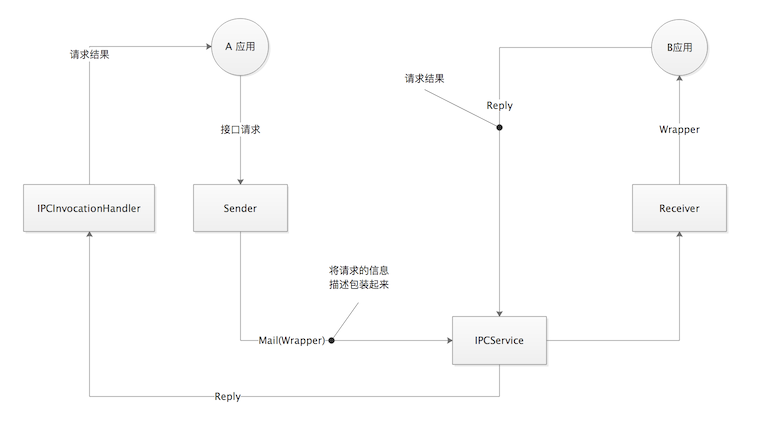

# XIPC实现原理

下图简易描述了实现的原理:



假设A应用需要请求B应用的接口服务，以下是实现的流程:

1.根据请求的接口，首先识别请求的类型，然后构建该请求对应的Sender。Sender里面包含请求接口、请求的方法、参数和需要连接的IPCService类名。

```
public abstract class Sender implements ISender {

    private long mTimeStamp;
    /**
     * 请求接口的类型
     */
    private ObjectWrapper mObject;
    /**
     * 请求的方法
     */
    private MethodWrapper mMethod;
    /**
     * 请求的参数
     */
    private ParameterWrapper[] mParameters;

    private Class<? extends IPCService> mService;

    ...
}

```

`ObjectWrapper`、`MethodWrapper`、`ParameterWrapper`都是包装类，继承`Parcelable`用于传输，里面详细描述了请求方法的类名或映射等详细信息。

2.`Sender`执行sender方法，获取请求的返回包装类Reply.

(1)Sender将所有`Wrapper`类打包放入`Mail`实体传给指定的IPCService。

```
public synchronized final Reply send(Method method, Object[] parameters) throws IPCException {
    mTimeStamp = TimeStampGenerator.getTimeStamp();
    if (parameters == null) {
        parameters = new Object[0];
    }
    ParameterWrapper[] parameterWrappers = getParameterWrappers(method, parameters);
    MethodWrapper methodWrapper = getMethodWrapper(method, parameterWrappers);
    registerClass(method);
    setParameterWrappers(parameterWrappers);
    Mail mail = new Mail(mTimeStamp, mObject, methodWrapper, mParameters);
    mMethod = methodWrapper;
    return CHANNEL.send(mService, mail);
}
```

(2)IPCService根据`Mail`中描述的请求类型，生成指定的`Receiver`来处理。

```
private final IIPCService.Stub mBinder = new IIPCService.Stub() {
    @Override
    public Reply send(Mail mail) {
        try {
            Receiver receiver = ReceiverDesignator.getReceiver(mail.getObject());
            int pid = mail.getPid();
            IIPCServiceCallback callback = mCallbacks.get(pid);
            if (callback != null) {
                receiver.setIPCServiceCallback(callback);
            }
            return receiver.action(mail.getTimeStamp(), mail.getMethod(), mail.getParameters());
        } catch (IPCException e) {
            e.printStackTrace();
            return new Reply(e.getErrorCode(), e.getMessage());
        }
    }

    @Override
    public void register(IIPCServiceCallback callback, int pid) throws RemoteException {
        mCallbacks.put(pid, callback);
    }

    @Override
    public void gc(List<Long> timeStamps) throws RemoteException {
        OBJECT_CENTER.deleteObjects(timeStamps);
    }
};
```

(3)`Receiver`执行action方法，通过`Wrapper`信息，反射执行相对应的方法，返回结果`Reply`

```
/**
 * 执行请求的方法，返回结果
 *
 * @param methodInvocationTimeStamp 方法执行的序号
 * @param methodWrapper             请求的方法
 * @param parameterWrappers         请求方法的参数
 * @return
 * @throws IPCException
 */
public final Reply action(long methodInvocationTimeStamp, MethodWrapper methodWrapper, ParameterWrapper[] parameterWrappers) throws IPCException {
    setMethod(methodWrapper, parameterWrappers);
    setParameters(methodInvocationTimeStamp, parameterWrappers);
    Object result = invokeMethod();
    if (result == null) {
        return null;
    } else {
        return new Reply(new ParameterWrapper(result));
    }
}
```

3.最后再通过动态代理`IPCInvocationHandler`，实现以上流程的动态执行。

```
public class IPCInvocationHandler implements InvocationHandler {

    private Sender mSender;

    public IPCInvocationHandler(Class<? extends IPCService> service, ObjectWrapper object) {
        mSender = SenderDesignator.getPostOffice(service, SenderDesignator.TYPE_INVOKE_METHOD, object);
    }

    @Override
    public Object invoke(Object proxy, Method method, Object[] objects) {
        try {
            Reply reply = mSender.send(method, objects);
            if (reply == null) {
                return null;
            }
            if (reply.success()) {
                return reply.getResult();
            } else {
                IPCLog.e("Error occurs. Error " + reply.getErrorCode() + ": " + reply.getMessage());
                return null;
            }
        } catch (IPCException e) {
            e.printStackTrace();
            IPCLog.e("Error occurs. Error " + e.getErrorCode() + ": " + e.getMessage());
            return null;
        }
    }
}
```